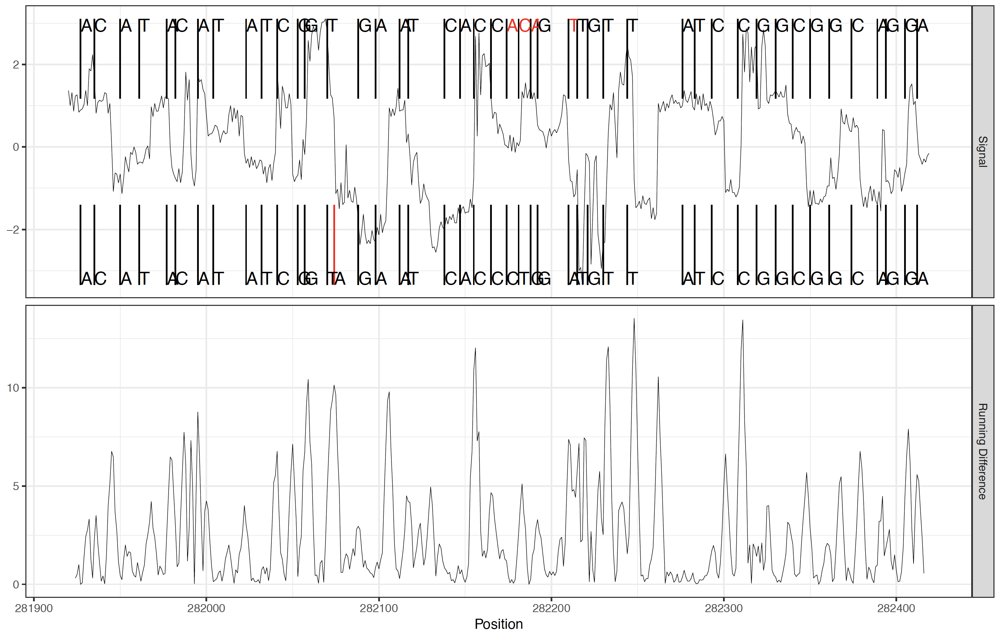

************************************
Model Training (Advanced Users Only)
************************************

Model training is made available via several Tombo commands, but should be used with care as these methods can be very sensetive to the samples used. Commands relevant to model training are found within the ``tombo build_model`` command group. The commands are ``estimate_reference`` for estimating a canonical bases model, ``estimate_alt_reference`` for estimation of a non-canonical alternative base model, and ``event_resquiggle`` for re-squiggling reads without a model (requires event-based basecaller results).

.. note::

   Model training produces a binary Tombo model file similar to those included in the Tombo software (found in the code repository here ``tombo/tombo_models``). User-created strandard Tombo models can be used in re-squiggling, modified base detection and plotting commands using the advanced ``--tombo-model-filename`` option. This option is generally for advanced users training their own models, so this option is not shown in the command line help documentation. Similarly user-created alternative models can be passed to plotting commands via the hidden ``--alternate-model-filename`` option and passed to any ``tombo detect_modifications`` command via the advanced ``--alternate-model-filenames`` option.

========================================
``tombo build_model estimate_reference``
========================================

The ``tombo build_model estimate_reference`` command is provided to estimate a Tombo model for canonical bases only.

To estimate a canonical model, first genomic base levels are parsed from reads as assigned by a re-squiggle command (either ``tombo build_model event_resquiggle`` or ``tombo resquiggle`` processed reads are acceptable) and grouped by their genomic base assignment. By default, the median and standard deviation of the current level over reads covering each genomic position is computed. The ``--estimate-mean`` option will trigger this to be computed as a mean instead, though this can be sensetive to outlier read signal assignment and is thus not recommended.

All genomic current levels are then grouped based on the genomic k-mer sequence at that location. This k-mer is defined by the ``--upstream-bases`` and ``--downstream-bases`` options. Note that the modeled k-mer will be one longer than the sum of these two options as the k-mer includes the *dominant*, central position as well. The central position generally has the strongest correlation with the current signal level as can be seen with the ``plot kmer`` command.

The reference signal level and spread for each k-mer are then estimated by taking the median of the signal level and mean of the standard deviation over all observations of each k-mer across the genome. By default, a single global standard deviation is taken as the median over all k-mers. The ``--kmer-specific-sd`` option is provided in order to estimate a seperate standard deviation for each k-mer, but is not recommended as this can have deleterious effects on Tombo analyses. In particular, k-mer specific standard deviation estimates can produce poor re-squiggle results due to signal being "packed" into high SD k-mers.

These values are stored in the output file in the binary HDF5 format and can be passed to any Tombo command that takes a Tombo model file.

Several options are supplied in order to ensure more robust parameter estimates via read depth thresholds at various stages of model estimation (``--minimum-test-reads``, ``--coverage-threshold`` and ``--minimum-kmer-observations``).

The model estimation command is capable of using mutiple processes via the ``--multiprocess-region-size`` and ``--processes`` options with similar behavior as these options in the ``tombo detect_modifications`` command. The multi-processing only applies to the genome position level computation and not the global model estimation stage; as such changes in multi-processing options will not change resulting models.

============================================
``tombo build_model estimate_alt_reference``
============================================

---------------------------
Alternative Reference Goals
---------------------------

One of the main goals of the Tombo suite of tools is to make alternative model estimation more accessible. Key to this goal is the estimation of an alternative model from a relatively simple to prodcue biological sample. A significant additional goal is the estimation of a model capable of detecting an alternative base in all sequence contexts.

In order to address these goals, the sample required for alternative model estimation must contain the four canonical bases along with a **single, known, alternative base incorporated randomly instead of one canonical base** into a sample with a known genome (referred to as the "*alternative sample*" below). The rate of incorporation for the alternative base should ideally be between 15% and 35%, though a larger range may be acceptable. Key to this method is that the exact known location of alternative base incorporation is not needed, though the base must incorporate in place of only a single canonical base (referred to as the "*swap base*" below and specified with the ``--alternate-model-base`` option to ``tombo build_model estimate_alt_reference``).

The creation of such a sample for the estimation of the included 5-methylcytosine (5mC) model was completed by introducing 25% (ratio to canonical dCTP) 5-methyl-dCTP into a standard PCR reaction in E. coil. Note that a standard PCR'ed (or otherwise produced canonical bases only) sample is also required for alternative model estimation (referred to as the "*standard sample*" below). For the included N6-methyladenosine (6mA) model, the sample was produced using an in vitro methylase thus exemplifying the flexibility of the alternative model estimation method to different sample preparation techniques. These samples were then re-squiggled and processed with the ``tombo build_model estimate_alt_reference`` command to produce the included 5mC and 6mA models.

---------------------------------------
Alternative Reference Estimation Method
---------------------------------------

Base Level Extraction
^^^^^^^^^^^^^^^^^^^^^

Given the above descsribed standard and alternative samples, the alternative model estimation procedure begins with the extraction of the current signal level from a number of reads from both samples. These signal levels are grouped by the genomic k-mer at the location assigned by the re-squiggle algorithm. Importantly, in contrast to standard reference estimation, the signal is not averaged or otherwise processed at the genomic position level. This is because each swap base genomic position contains some proportion of canonical and alternative bases.

Reads continue to be processed until every k-mer has at least ``--minimum-kmer-observations`` unique event observations. For PCR'ed samples in paricular, the ``tombo filter level_coverage`` command can help speed up this processing step if the sample coverage is highly variable. In order to save on the memory footprint, event levels are no longer stored once 10,000 obervations have been made for a particular k-mer.

Signal Level Density Estimation
^^^^^^^^^^^^^^^^^^^^^^^^^^^^^^^

Once enough observations have been parsed for each k-mer, a kernel density estimate is computed for each k-mer within the standard and alternative samples. This kernel density estimate can be controled with the ``--kernel-density-bandwidth`` option. The density estimates can be stored by specifying the ``--save-density-basename`` option, and this is highly recommended as the event extraction can be a long process. Future estimation efforts can then load these density estimates using the ``--alternate-density-filename`` and ``--control-density-filename`` options. Additionally, the ``scripts/debug_est_alt.R`` script can produce some useful visualizations from these files.

Alternative Base Density Isolation
^^^^^^^^^^^^^^^^^^^^^^^^^^^^^^^^^^

After standard and alternative kernel density estimation, an algorithm is applied to isolate the alternative distribution. This algorithm assumes that a portion of each alternative current level density represents the canonical only density. Thus when this portion of the alternative density is "subtracted" away, the alternative base distribution is all that is left.

Alternative Base Incorporation Rate
^^^^^^^^^^^^^^^^^^^^^^^^^^^^^^^^^^^

The first step in this process is to estimate the fraction of each k-mer alternative density composed of canonical signal levels. In order to estimate this value, the ratio of the highest peak of the standard density and the closest peak in the alternative sample density is computed for all k-mers including exactly one swap base. Before this ratio computation, alternative densities is shifted due to scaling issues for highly modified samples. This shift is estimated from the emperical signal levl distributions at each non-swap-base-containing k-mer and is fitted with a quadratic function.

Most of these k-mers are likely to shift the signal only slightly (though this may not hold true for large or charged alternative bases). Some small proportion of k-mers are likely to shift the signal observed significantly such that the standard and alternative base densities are essentially seperated and thus the ratio of these peaks represents close to the true alternative base incorporation rate. Thus a lower percentile of these ratios is taken as the true rate of alternative base incorporation. This percentile is defined by the ``--alt-fraction-percentile`` option, with a default value of the fifth percentile. This value is also printed to stderr during the estimation command as a reference.

----

.. figure::  _images/alt_density_est.png
   :align: center

   Canonical and spike-in 5mC example 6-mer signal level distributions and estimated 5mC distribution

----

Canonical Density "Subtraction"
^^^^^^^^^^^^^^^^^^^^^^^^^^^^^^^

Once the alternative base incorporation rate has been obtained, the alternative base expected level is computed by first isolating the alternative base density. This computation simply involoves subtracting, from the alternative sample kernel density estimate, the canonical kernel density estimate scaled by the alternative base incorporation rate. Any position where the scaled canonical density is greater than the alternative sample density is set to zero. Each k-mer's expected signal level is then taken as the weighted mean computed from the isolated alternative density. The spread for each k-mer is taken as the globally estimated standard deviation from the canonical model estimation as spread measures from the isolated distribution are not robust.

For k-mers not containing any swap bases, the standard model expected level is taken. For kmers containing more than one swap base, the canonical distribution scaling factor is adjusted appropraitely assuming that each swap base has the same estimated incorporation rate. This is why only single swap base k-mers are used in the incorporation rate estimation stage.

Alternative Model Output
^^^^^^^^^^^^^^^^^^^^^^^^

The alternative model is then saved to the file specified with the ``--alternate-model-filename`` option. Also specified is the ``--alternate-model-name`` option, which should be a short name describing the alternative base. When ``tombo detect_modifications`` is run with this alternative model, the results are saved with this short name included in the output Tombo statsitics filename.

======================================
``tombo build_model event_resquiggle``
======================================

The ``tombo build_model event_resquiggle`` command performs the re-squiggle algorithm first developed as part of the nanoraw software package. This command requires an events table, but does not require an expected current level model. In the model training framework, this command can be useful as the original model training step, for example when no Tombo model is available for a particular chemistry.

In comparison to the ``tombo build_model resquiggle`` command, this method maps a read to a genome, but then takes the initial signal to base assignment from the Events table. The read is anchored to the raw signal at locations where the read maps correctly to the genome. Where ever a read incorrectly maps to the genome the re-squiggle algorithm discovers new base boundaries based only on the significant changes in signal level (generally indicative of transition from one base to the next).

This method has several known failure modes and thus the model aware re-squiggle algorithm is strongly preferred when a valid model is available.

Note that this method does make alternative signal normalization methods available, but only median normalization is supported in all other Tombo commands.

----

   Event re-squiggle correction process from basecalls (top segments) to genomic sequence(bottom segments)

----

====================================
``tombo build_model estimate_scale``
====================================

The ``tombo build_model estimate_scale`` command is provided in order to estimate a global scaling parameter from a sub-set of reads in a run (as is performed by default at the beginning of the ``tombo resquiggle`` command). The value returned may be useful as the value passed to the ``--fixed-scale`` option of the ``tombo resquiggle`` command in certain situations, but is considered experimental at this time.
