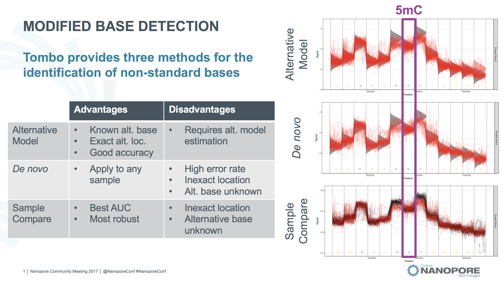

***********************
Modified Base Detection
***********************

Tombo enables three methods for detecting shifts in current signal level, indicative of non-canonical bases. These three methods allow researchers to investigate non-canonical bases given any sample type, while also enabling more accurate detection of specific known modifications when applicable.

----

   
   Tombo modified base testing methods.

----

All three methods are accessed by the ``test_significance`` Tombo sub-command as described below.

**TL;DR**:

* To identify 5-methylcytosine (5mC) and N6-methyladenosine (6mA), run ``test_significance`` with the ``--alternate-bases 5mC 6mA`` option
* For more experimental de novo modified base detection simply run ``test_significance`` with just a set of reads
* For modified base detection via comparison to a control sample (e.g. PCR) run ``test_significance`` with a control set of reads (``--control-fast5-basedirs``)
* The ``test_significance`` command will produce a binary file (not intended for use outside the Tombo framework)
  
  - To extract useful text files use the ``write_wiggles`` command
  - To visualize raw signal around significant regions use the ``plot_most_significant`` command
  - To assess testing results around a known motif use the ``plot_motif_with_stats`` and ``plot_roc`` commands

.. hint::
   
   The ``resquiggle`` command must be run on a set of reads before processing with ``test_significance``.

-------------------
Statistical Testing
-------------------

For all statistical testing methods, the result is a binary Tombo statistics file. This file contains statistics associated with each validly tested genomic base. This file is not intended for use outside of the Tombo framework. Several Tombo commands (e.g. ``write_wiggles``, ``write_most_significant_fasta`` and ``plot_most_significant``) take the statistics file as an input, accommodating many user pipelines downstream of modified base detection.

Of particular interest, the statistics file contains the fraction of reads at each genomic position passing a set threshold (``--single-read-threshold``). This value is set to a default of 0.1 FDR-corrected p-value for the control sample comparison method, 0.5 FDR-corrected p-value and a log likelihood ratio of 0.0 for the alternative model likelihood ratio method. Note that for likelihood ratio test fractions, some reads may fall between the +/- threshold values. The number of reads falling outside of the threshold values is saved under the ``valid_cov`` column in the statistics file.

For the de novo and alternative model testing approaches a default canonical model is used (included with Tombo). Users may also train their own canonical Tombo model (possibly for an older chemistry version) and test against this model using the hidden ``--tombo-model-filename`` option. See more in the :doc:`model_training` section.

Another available output from the ``test_significance`` sub-command is a per-read (and per-base) binary (HDF5) statistics file (via ``--per-read-statistics-basename`` option). This file is currently made available for research on per-read modified base detection including plotting via the ``plot_per_read`` sub-command and further computing via the ``aggregate_per_read_stats`` sub-command. For advanced researchers, the per-read statistics data can be accessed (including random access to particular regions of the genome) using the ``tombo.tombo_stats.PerReadStats`` class from the Tombo python API.

Alternative Model Method
========================

In order to specifically detect 5mC and 6mA, use the ``test_significance`` command with the ``--alternate-bases`` option. Users may also train their own alternative base Tombo models and test against these with the hidden ``--alternate-model-filenames`` option (this option is hidden from the command line help as it is intended only for advanced users). See more details in the :doc:`model_training` section.

This will perform a log likelihood ratio test using the default canonical and the specified alternative models provided with Tombo (5mC and 6mA). This likelihood ratio is computed over all positions modeled. The default DNA model is a 6-mer, so the signal at the six surrounding genomic bases contribute to the log likelihood ratio test statistic at any one position.

For example for 5mC detection within in a TGGTA **C** GTCCG context, the signal will be tested against expected canonical and alternative 5mC levels at the following locations::

  TGGTA **C** GTCCG
  -----------------
  TGGTA **C**
   GGTA **C** G
    GTA **C** GT
     TA **C** GTC
      A **C** GTCC
        **C** GTCCG

New alternative base models will be added as they are trained and validated internally. This is the perferred method for modified base detection if a model is available for your biological sample of interest as the exact modification position is identified.

.. code-block:: bash

    tombo test_significance --fast5-basedirs <fast5s-base-directory> \
        --alternate-bases 5mC 6mA --statistics-file-basename sample_alt_model

    # if you have trained you own alternative base model
    tombo test_significance --fast5-basedirs <fast5s-base-directory> \
        --alternate-model-filenames alternative_base.tombo.model \
        --statistics-file-basename sample_user_alt_model

Canonical Sample Comparison Method
==================================

In order to perform *canonical sample comparison* modified base detection, use the ``test_significance`` command with a second set of reads from the same biological sample containing only canonical bases (e.g. PCR) via the ``--control-fast5-basedirs``.

For each sample read, this will perform a hypothesis test against a normal distribution estimated from the signal level observed from the control sample reads at each genome position. This method provides the highest accuracy (as effects outside of the default modeled 6-mer are accounted for in the control sample), but does not always identify the exact modification position or identity of the modified base.

Note that no model is used in the application of this method. Instead the testing null distribution is estimated at each genomic location from the control set of reads.

For both this method, as well as the canonical model method, the ``--fishers-method-context`` option will combine test values, using `Fisher's Method <https://en.wikipedia.org/wiki/Fisher%27s_method>`_, over a moving window extending a number of positions in either direction. Due to the nature of nanopore sequencing, the genomic context surrounding the read head effect that current at any position. Thus shifts in signal due to a modified base may occur at several positions to either side of the true modified location. Thus combining statistical test values across several genomic positions can help to center significant values on the truly modified position. The default value for this parameter is 1, but reasonable results can be obtained for values between 0 and 3.

.. code-block:: bash

    tombo test_significance --fast5-basedirs <fast5s-base-directory> \
        --control-fast5-basedirs <control-fast5s-base-directory> \
        --statistics-file-basename sample_canonical_compare

De novo Non-canonical Base Method
=================================

In order to perform de novo non-canonical base detection, use the ``test_significance`` command with no other options (aside from the set of reads to test).

For each read, this will perform a hypothesis test against the canonical model based on the genomic sequence at each position. Note that this method can be quite error prone and may result in a high false positive rate, but may be of use in a research and development setting. This method also has the lowest barrier to entry, requiring only a set of reads and a genome, allowing any nanopore researcher to start investigating modified bases.

.. code-block:: bash

    tombo test_significance --fast5-basedirs <fast5s-base-directory> \
        --statistics-file-basename sample_de_novo_detection

----------------
Multi-processing
----------------

Tombo statistical testing provides the option to perform testing spread across multiple processes. This also limits the memory requirement for modified base detection, as all testing values across a region are held in memory. If the ``test_significance`` command seems to be using too much memory, consider lowering the ``--multiprocess-region-size`` value.

Multi-processing is performed over batches delineated by regular intervals across chromosomes covered by at least one read. The interval size is determined by the ``--multiprocess-region-size`` option and processed by ``--processes`` individual processes independently. The produced per-base results are identical no matter the multi=processing options selected. These regions are also used as batches to store the pre-read statistics file.

----------------------------
Tombo Statistics File Format
----------------------------

While the Tombo statistics file is meant to be a binary file not processed by outside tools its contents are described here for completeness. The Tombo statistics file is in the HDF5 format. There is one attribute at the root level, ``stat_type`` indicating which testing method was used (``model_compare``, ``de_novo`` or ``sample_compare``).

The per-base statistics are stored in a dataset, ``stats``, containing one record for each genomic base. Each record contains the following attributes: ``frac``, ``pos``, ``chrm``, ``strand``, ``cov``, ``control_cov``, and ``valid_cov``.

``pos``, ``chrm`` and ``strand`` define the zero-based genomic position for this record.

``frac`` contains the fraction of valid (not including positions with ``-single_read_threshold < stat < single_read_threshold``) reads at this genomic position identified as the standard base.

``cov``, ``control_cov``, and ``valid_cov`` contain the read coverage at the genomic position for the sample and control reads. ``control_cov`` is only applicable for the control sample comparison testing method. ``valid_cov`` contains the number of reads contributing to the ``frac`` of tested reads as defined by ``--single-read-threshold`` (only applicable for the alternative model comparison method; set to ``cov`` for other methods).

-------------------------------
Per-read Statistics File Format
-------------------------------

Per-read statistics can be stored by setting the ``--per-read-statistics-basename`` option to the ``test_significance`` command. This output file can then be used in downstream Tombo sub-commands (e.g. the ``plot_per_read`` and ``aggregate_per_read_stats`` commands).

For advanced users the Tombo per-read statsitics file can be accessed via the Tombo python API using the ``tombo.tombo_stats.PerReadStats`` class. This class provides initialization, simply taking the per-read statsitics filename. The ``PerReadStats`` class supports the ``get_region_stats`` function which takes a ``tombo.tombo_helper.intervalData`` object specifying an interval of interest. This will return a numpy array containing a record for each read (specified by the ``read_id`` field) and each tested genomic position (``pos`` field) along with the test statistic (``stat`` field) at that location.

.. important::
   
   All other optional arguments to the ``tombo.tombo_stats.PerReadStats`` constructor should be left as ``None``; setting these values will delete the file and construct a blank per-read statistics file.

The per-read statistics file is in the HDF5 format. All blocks are stored within the ``Statistic_Blocks`` slot. The size of the blocks is stored in the ``block_size`` attribute (defined by the ``--multiprocess-region-size`` option) and the type of statistical test applied is stored in the ``stat_type`` attribute.

Each genomic block is stored in a different ``Block_[##]`` slot. These slots do not have any particular order. Within each block the ``chrm``, ``strand`` and ``start`` of the block are stored. The block statistics are stored in the ``block_stats`` slot. Per-read statistics contain a record for each tested location within each read. Each record contains the genomic position (``pos``), the test statistic (``stat``; hypothesis test p-value or log likelihood ratio as indicated by the statistic type), and the ``read_id``. A single read spanning multiple blocks will contain statistics in more than one block. An individual read's statistics can be reconstructed using the ``read_id`` field.

-----------------------------
Aggregate Per-read Statistics
-----------------------------

In order to facilitate research on the per-genomic base aggregation, Tombo provides the ``aggregate_per_read_stats`` sub-command. The primary utility for this sub-command is to test alternative per-read threshold values. It is not possible to change other testing parameters from this sub-command (e.g. ``--fishers-method-context`` or ``--tombo-model-filename``).
