*****************
Plotting Commands
*****************

In order to enhance modified base detection and give users a better grasp of raw nanopore data, Tombo provides a number of plotting commands.

------------------------
Genome Anchored Plotting
------------------------

Plot Region Selection
^^^^^^^^^^^^^^^^^^^^^

Most Tombo plotting functions are genome-anchored. These commands create plots analogous to a genome browser, but with all raw signal within a region. The available commands each differ in their mode of genome region selection. This allows users to plot regions of interest for many research contexts.

* ``plot_max_coverage`` - Select regions with maximal coverage
* ``plot_genome_location`` - Select specified genomic locations
* ``plot_motif_centered`` - Select regions with a specific motif (follows `NEB single letter codes <https://www.neb.com/tools-and-resources/usage-guidelines/single-letter-codes>`_)
* ``plot_max_difference`` - Select regions where two samples' average signal differs most
* ``plot_most_significant`` - Select most consistently/significantly mofidied locations

These plotting commands produce raw signal level plots such at the example below. Options are available for each of these plots to logically select genomic regions based on the given criterion.

.. note::

   All genome-anchored plots use 1-based coordinate systems (similar to the majority of genome browsers).

----

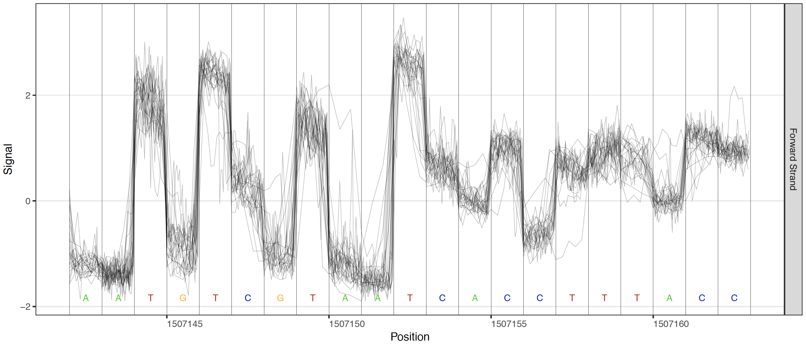
   
   Single sample raw signal plot

----

Model Plotting
^^^^^^^^^^^^^^

Plots are also enabled to visualize the different testing frameworks available in Tombo. These plots include a control sample, the standard model or any non-standard base model, visualizing the control sample comparison, de novo and log likelihood ratio tests respectively.

Control these plots with these options: ``--control-fast5-basedirs``, ``--plot-standard-model``, ``--plot-alternate-model 5mC``, ``--tombo-model-filename``, and ``--alternate-model-filename``.

----

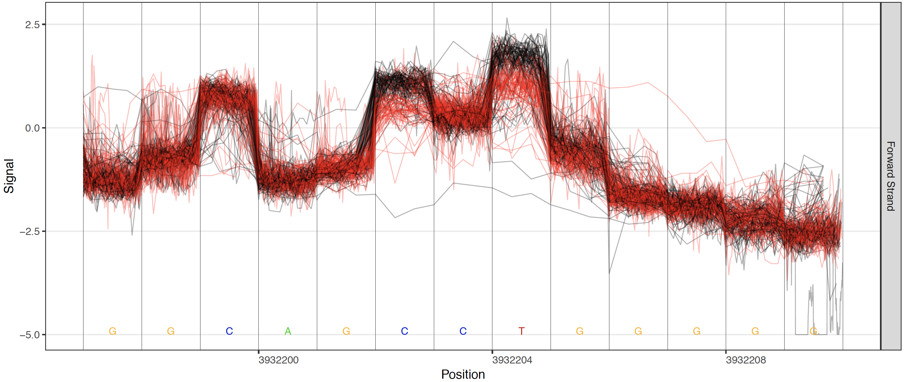
   
   Control sample comparison plot

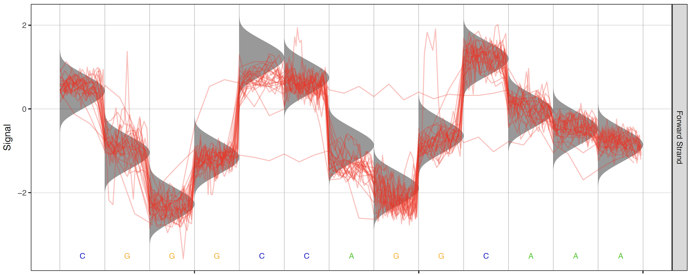
   
   Standard model plot

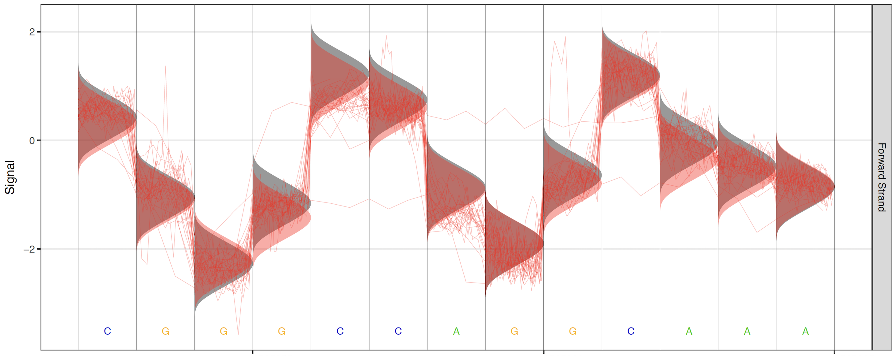
   
   Alternate model plot

----

Over-Plotting
^^^^^^^^^^^^^

When high coverage regions are plotted the raw signal plots can become less interpretable. By default, when read coverage exceeds 50X reads are randomly downsampled to 50X coverage (change this threshold with the ``--overplot-threshold`` option). Three additional over-plotting types (boxplot, quantile and density) are available as shown below (chose which over-plotting type to use with the ``--overplot-type`` option).

----

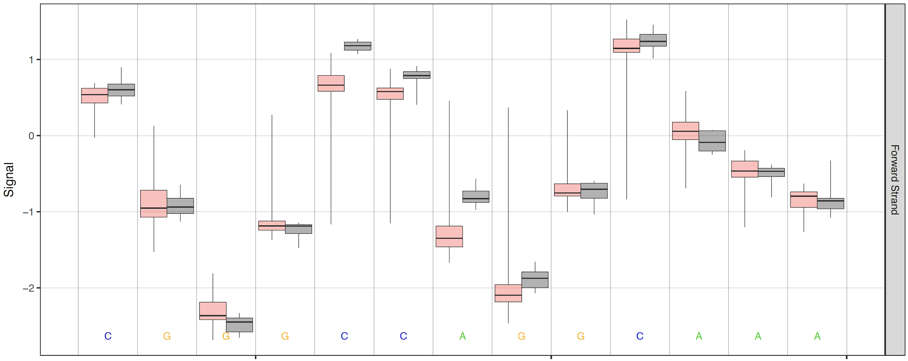
   
   Boxplot over-plotting option

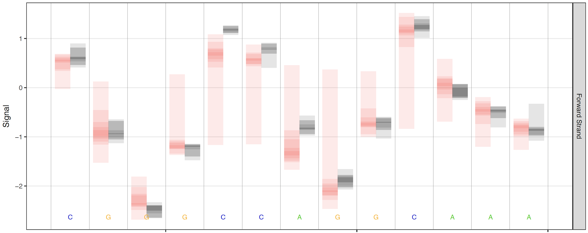
   
   Quantile over-plotting option

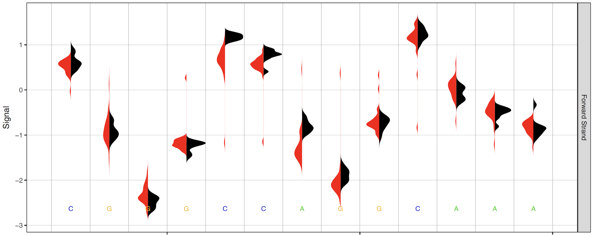
   
   Density over-plotting option

----

Per-read Plotting
^^^^^^^^^^^^^^^^^

All testing in the Tombo framework is applied first on a per-read basis; to visualize these per-read results, per-read statistic plots are available. Per-read statistics are an optional output from the ``test_significance`` command via the ``--per-read-statistics-filename`` option, and the output file specified by this option is required in order to the plot per-read statistics command. Create these plots with the ``plot_per_read`` command.

----

.. figure::  _images/pre_read_5mC.png
   :align: center
   :scale: 30%
   
   Alternative 5mC model testing

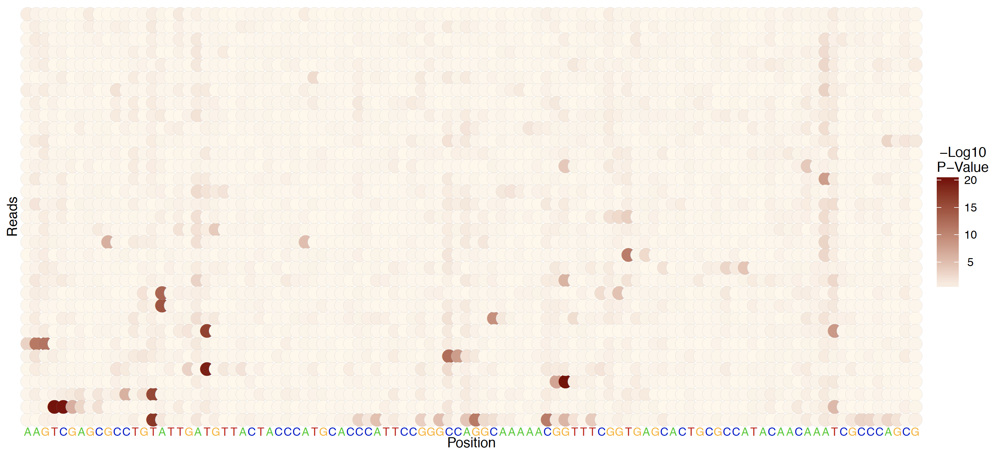
   
   De novo, standard model, per-read testing

----

Motif-centered Statistic Plotting
^^^^^^^^^^^^^^^^^^^^^^^^^^^^^^^^^

In several biological contexts base modifications occur at specific motifs. In order to visualize the distribution of Tombo statistical test results centered on a motif of biolgical interest (or a discovered motif) the ``plot_motif_with_stats`` command is provided.

This command identifies a number (defined by ``--num-statistics``) of genomic regions centered on this motif with the highest significance testing values. Importantly, the identified highest testing values need not be found within the actual motif, but simply within a region containing the motif defined by ``--num-context``. In this way, non-interesting motifs (motifs which don't direct modifications) will not contain more significant statistics centered on a specific position within the provided motif. A number (defined by ``--num-regions``) of example regions with the highest test statistics centered on the motif of interest are plotted as well.

----

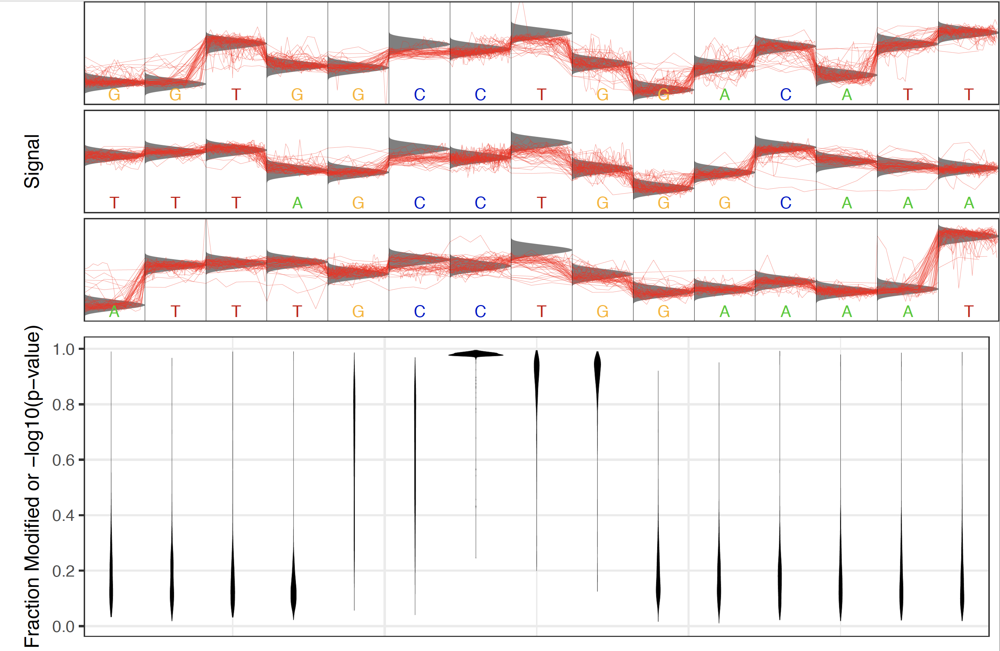
   
   Example statistics distribution around `biologically relevant CCWGG motif in E. coli <https://www.neb.com/tools-and-resources/usage-guidelines/dam-and-dcm-methylases-of-e-coli>`_

----

-----------------------
Other Plotting Commands
-----------------------

K-mer Level Distributions
^^^^^^^^^^^^^^^^^^^^^^^^^

In order to investigate the k-mer signal current levels of a particular set of reads, the ``plot_kmer`` command is provided.

----

.. figure::  _images/kmer_levels.png
   :align: center
   :scale: 30%
   
   Example k-mer current level distribution plot

----

ROC Curves
^^^^^^^^^^

In order to validate the performance of significance testing results at a known sequence motif, the ``plot_roc`` command is provided. This command takes a Tombo statistics file, corresponding motif descriptions and the genome FASTA file. The "area under the curve" (AUC) for each motif is printed and the precision-recall curve is also plotted for each motif on the second page of the resulting PDF. Note that only genomic positions with the canonical base of interest are included in the results from this command.

Below is an example command and resulting plot for identifying the known dam and dcm methylase contexts in E. coli using all three provided testing methods.

.. code-block:: bash

    tombo plot_roc \
        --statistics-filenames vs_pcr.tombo.stats de_novo.tombo.stats \
        5mC_model.5mC.tombo.stats 6mA_model.6mA.tombo.stats \
        --motif-descriptions CCWGG:2:"dcm 5mC Sample Comp"::GATC:2:"dam 6mA Sample Comp" \
        CCWGG:2:"dcm 5mC De novo"::GATC:2:"dam 6mA De novo" \
        CCWGG:2:"dcm 5mC Alt Comp" GATC:2:"dam 6mA Alt Comp"  \
        --genome-fasta e_coli.fasta

----

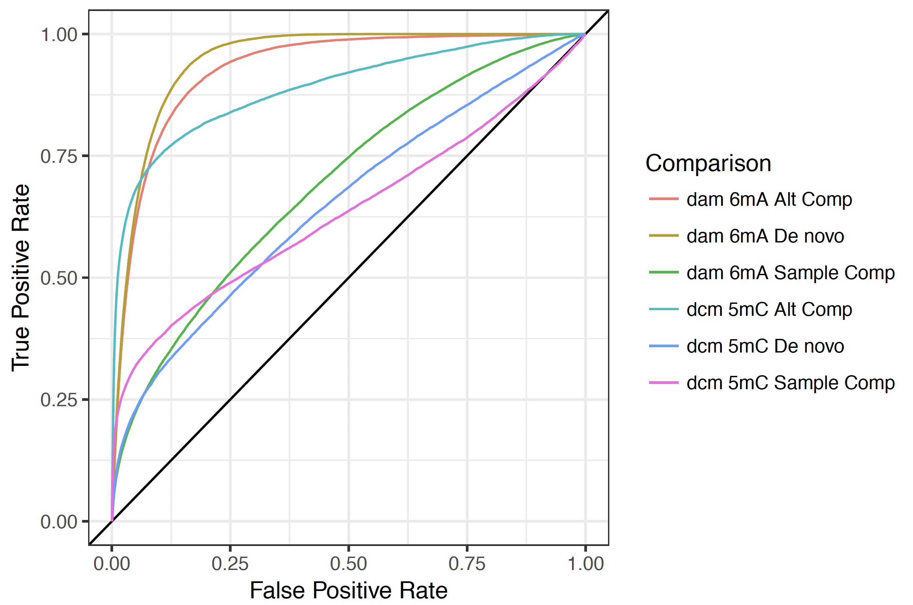
   
   Example ROC curve plot

----

It is also possible to compute and plot validation results on a per-read basis from a Tombo per-read statistics file. Along with ROC and precision-recall curves, this command also plots a distribution of test statistics for true and false ground truth sites (see figure below) for each motif provided. These plots can be very useful in picking a ``--single-read-threshold`` for use in either the ``test_significance`` or ``aggregate_per_read_stats`` sub-commands.

.. code-block:: bash

    tombo plot_roc \
        --statistics-filenames vs_pcr.tombo.per_read_stats de_novo.tombo.per_read_stats \
        5mC_model.5mC.tombo.per_read_stats 6mA_model.6mA.tombo.per_read_stats \
        --motif-descriptions CCWGG:2:"dcm 5mC Sample Comp"::GATC:2:"dam 6mA Sample Comp" \
        CCWGG:2:"dcm 5mC De novo"::GATC:2:"dam 6mA De novo" \
        CCWGG:2:"dcm 5mC Alt Comp" GATC:2:"dam 6mA Alt Comp"  \
        --genome-fasta e_coli.fasta

----

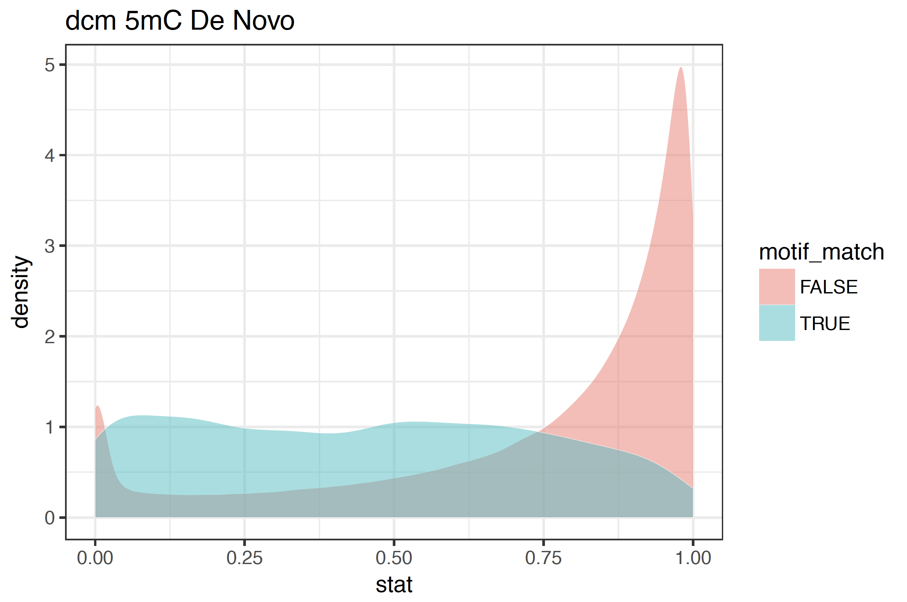
   
   Example per-read statistic distribution

----
