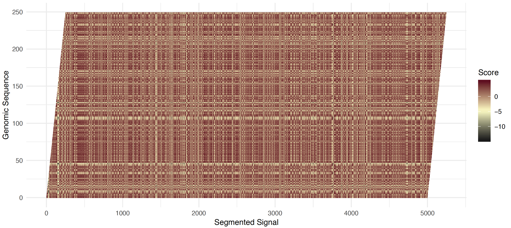
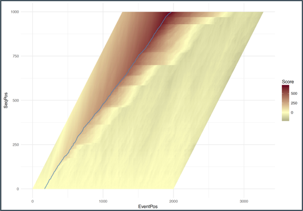
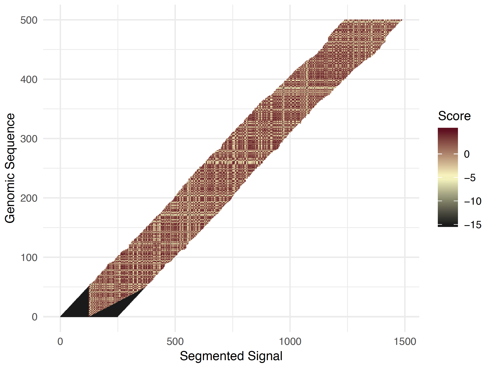
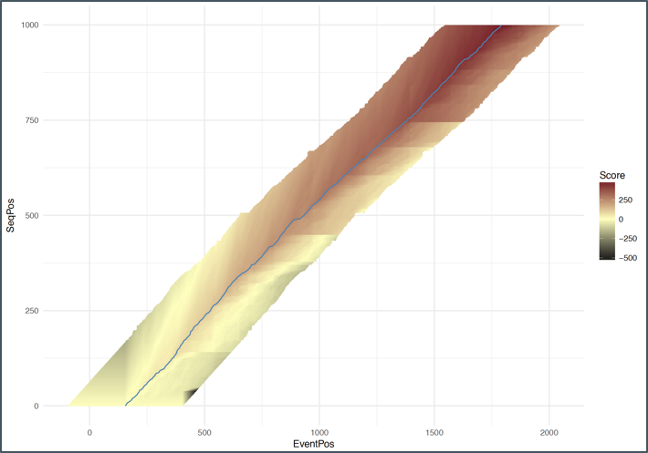

*********************
Re-squiggle Algorithm
*********************

The signal level data produced from a nanopore read is referred to as a squiggle. Base calling this squiggle information generally contains some errors compared to a refernce genome, so this algorithm defines a new squiggle sequence assignment, hence a re-squiggle.

The re-squiggle algorithm is the basis for the Tombo framework. The re-squiggle algorithm takes as input a FAST5 containing raw signal and associated base calls. The base calls are mapped to a genome reference and then the raw signal is assigned to the genomic sequence based on an exprected current level model.

TL;DR:

*  Re-squiggle must be run before any other Tombo command
*  Minimally the command takes a directory containing FAST5 files, a genome reference and an executable mapper.
*  FAST5 files must contain basecalls (as produced by albacore with fast5 mode), but need not contain the "Events" table
*  Tombo currently only supports R9.4 and R9.5 data (via included default models). Other data may produce sub-optimal results
*  DNA and RNA reads will be detected automatically and processed accordingly

-----------------
Algorithm Details
-----------------

The re-squiggle algorithm occurs in 4 main steps described below.

* Genome Mapping
* Event Detection
* Sequence to Signal Assignment
* Resolve Skipped Bases

Genome Mapping
--------------

The genome mapping is performed via one of the Tombo supported mapping programs (``minimap2``, ``graphmap`` and ``bwa-mem``). This operation can be spread over multiple processes via the ``--processes``, ``--align-processes`` and ``--align-threads-per-process`` arguments. Each process pulls reads off a queue to run mapping operations in batches of ``--alignment-batch-size``. These mappings are then processed to extract the genomic sequence and these sequences are placed in a second queue to be processed later.

Read base called sequence location within the FAST5 file is defined by the ``--basecall-group`` and ``--basecall-subgroups`` command line options. The default values of these parameters point to the default location for base calls from albacore.

Note that each process currently reads the whole reference genome into memory in order to process SAM formated mappings. Take care when running Tombo on larger genomes ot avoid overflow a systems memory. This is true even if the optional ``--minimap2-index`` parameter is provided. The minimap2 index parameter only effects the mapping call itself.

When using ``bwa-mem`` note that the reference fasta must be indexed. Unfortunately, this error is currently not caught until after extracting read sequence and attempting to map, and will result in all reads failing due to no apparent alignment being produced (results in failed read message ``Alignment not produced (if all reads failed check for index files)``).

Event Detection
---------------

The Tombo algorithm does not require the "events" (blocks of raw signal potentially corresponding to bases) table. Instead, Tombo discovers events from the raw signal. This segmented signal makes downstream processing steps more efficient and stable. This event detection algorithm is different from the event detection performed in albacore, but produces very simimlar results.

Events are determined by identifying large shifts in current level, by taking the running difference between neighboring windows of raw signal (3 observations for DNA and 20 for RNA). The largest jumps are chosen as the breakpoints between events. The mean of normalized raw signal is then computed for each event.

Signal normalization is performed on each read by shifting to a median of zero and scaling with the median absolute deviation (MAD). By default, a global scaling value is taken as the mean of the MAD from a random sample of reads and used to scale all reads. This behaviour can be overriden with ``--fit-scale-per-read`` option to fit the MAD scaling value from each read seperately or the ``--fixed-scale`` argument to manually set the scaling value (advanced users only). Raw signal is also windsorized based on the value of the ``--outlier-threshold`` parameter. These scaling parameters are stored in the Tombo slot for access in later commands.

Sequence to Signal Assignment
-----------------------------

Given the mapped genomic sequence and segmented signal, the sequence to signal assignment algorithm finds the most likely matching of these two.

The algorithm first uses a large bandwidth (2000 events over the first 500 genomic bps) to identify the start of the genomic sequence within the events (see figure below). This is necessary as some portion at the beginning of a read is not base called and some additional sequence may have been trimmed by the alignment. The matching is determined by applying a dynamic programming algorithm to find the most likely matching between the event signal levels and the expected signal levels given the genomic sequence.

----

   
   Read start shifted half-normal scores

   
   Read start forward pass scores

----

First a static banded matrix is constructed by computing the z-score on each event level against each genomic position (see figure **a** above). The absolute value is then taken of this z-score and then flipped and shifted such that the expected value given a correct matching is zero. A forward pass computes the maximal cummulative score up to each matched event to genome position (see figure **b** above). At each iteration the maximal score is taken over three possibilities 1) staying in the same genomic position, and accumulating the shifted z-score 2) matching an event with a genomic position (with score bonus defined by ``--match-expected-value``) 3) skipping this genomic position (with a score penalty defined by ``--skip-penalty``). From this forward pass the maximal score along the last genomic position is taken and traced back to obtain the starting position of matching sequence and signal.

If a read is short enough (less than 2,500 events or less than 500 bps of called sequence), then the whole sequence to signal matching will be performed with a single run with an appropriate static bandwidth.

For longer reads, the above computed start matching position is taken and then the same dynamic programming solution is applied except a smaller (definied by ``--bandwidth``) adaptive band is now used (see figure below). At each genomic position, the band position is defined to center on the current maximal score of the forward pass. This aims to ensure that the traceback path will remain within the adaptive window. There are edge cases where the valid matching leaves the adaptive band. These reads are filtered out and included in the failed read group ``Read event to sequence alignment extends beyond --bandwidth``.

----

   
   Full read adaptive banded shifted half-normal scores

   
   Full read adaptive banded forward pass scores

----

Resolve Skipped Bases
---------------------

After the dynamic programming step, skipped bases must be resolved using the raw signal to obtain a matching of each genomic base to a bit of raw signal. A region around each skipped genomic base is identified. Then a dynamic programming algorithm very similar to the last step is performed, except the raw signal is used instead of events and the skip move is not allowed. Additionally, the algorithm forces each genomic base to be assigned at least 3 raw observations to produce more robust assignments. After this procedure the full genomic sequence has raw signal assigned.

------------------
Tombo FAST5 Format
------------------

The result of the re-squiggle algorithm writes the sequence to signal assignment back into the read FAST5 files (found in the ``--corrected-group`` slot; the default value is the default for all other Tombo commands to read in this data). When running the re-squiggle algorithm a second time on a set of reads, the --overwrite option is required in order to write over the previous Tombo results.

The Tombo slot contains several useful bits of information. The ``--corrected-group`` slot contains attributes for the signal normalization (shift, scale, upper_limit, lower_limit and outlier_threshold) as well as a binary flag indicating whether the read is DNA or RNA. Within the ``Alignment`` group, the gemomic mapped start, end, strand and chromosome are stored. The mapping statistics (number clipped start and end bases, matching, mismatching, insertioned and deleted bases). Note that this information is not enabled at this time, but should be added back soon.

The ``Events`` slot contains a matrix containing the matching of raw signal to genomic sequence. This slot contains a single attribute (``read_start_rel_to_raw``) giving the zero-based offset into the raw signal slot for genomic sequence matching. The events table then starts matching sequence from this offset. Each entry in the ``Events`` table indicates the normalized mean signal level (``norm_mean``), optionally (triggered by the ``--include-event-stdev`` option) the normalized signal standard deviation (``norm_stdev``), the start position of this base (``start``), the length of this event in raw signal values (``length``) and the genomic base (``base``).

This information is accessed as needed for down-stream Tombo processing commands.

-------------------------------
Common Failed Read Descriptions
-------------------------------

``Alignment not produced (if all reads failed check for index files)``

*  This error indicates that either the mapping program did not produce a valid mapping or index files are not available (primarily for BWA-MEM).

``Fastq slot not present in --basecall-group``
``Raw data is not found in Raw/Reads/Read_[read#]``

*  These error indicates that a necessary peice of information for Tombo to run was not found in the FAST5 file.

``Could not close FAST5 file. Possibly corrupted file``

*  This error indicates that an unexpected error occurred trying to open or close a read file. This can happen if zombie processes are still accessing the files or if files are actively being accessed by another program.

``Adaptive signal to seqeunce alignment extended beyond raw signal``
``Read event to sequence alignment extends beyond --bandwidth``
``Too little signal around event-aligned genomic deletion``

*  These errors indicate that something seemed off when attempting to perform sequence to signal matching

``No valid path found through raw signal of long read``
``No valid path found through start of raw signal``
``No valid path found through raw signal of short read``

*  These errors indicate that the dynamic programming algorithm produce a poorly scored matching of genomic sequence to raw signal. This likely indicates that either the genomic mapping is incorrect or that the raw signal is of low quality in some sense.

----------------
Tombo Index File
----------------

By default, Tombo will create a hidden file containing the essential genomic mapping location for each validly processed read. This file will be located alongside the base fast5s directory. For example, if resquiggle is called on this directory ``/path/to/fast5/reads/`` then the following file will be created ``/path/to/fast5/.reads.RawGenomeCorrected_000.tombo.index``. This file should generally be about 1,000 times smaller than the corresponding FAST5s and so should not impeed significantly on disk space. If desired, the index can be skipped with the ``--skip-index`` option. Note that this will make most all downstream commands much slower as each read will be queried to produce the index in memory each time another Tombo command is run.

-------------------------------
Additional Command Line Options
-------------------------------

``--failed-reads-filename``

*  This option outputs the filenames for each read that failed via each failure mode. This can be useful for tracking down bothersome errors.

``--obs-per-base-filter``

*  This option applies a filter to "stuck" reads (too many observations per genomic base). This filter is applied only to the index file and can be cleared later. See the Filters section for more details.
