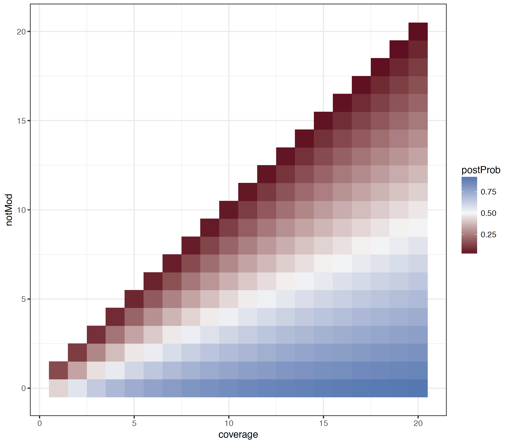

************
Text Outputs
************

Two text outputs are available from Tombo:

1. Wiggle - Genome browser compatible run per-base statistics
2. Fasta - Sequence output surrounding most modified sites

``write_wiggles``
-----------------

The ``write_wiggles`` command takes in a set of reads (``--fast5-basedirs``) and/or a pre-computed statistics file (``--statistics-filename``). A control set of reads can also be provided (``--control-fast5-basedirs``). Output wiggle files (`variableStep format <https://genome.ucsc.edu/goldenpath/help/wiggle.html>`_) will be produced for each requested statistic (both plus and minus strands).

Several statistics are available for output:

* ``coverage`` - The coverage level for mapped and validly re-squiggled reads
* ``dampened_fraction`` - The estimated fraction of significantly modified reads
  
  - This estimate includes pseudo-counts added to the un-modified and modified read counts (as specified by the ``--coverage-dampen-counts`` option)
  - This is equivalent to using a beta prior when estimating the fraction of reads modified at this position
  - Test the effect of different dampen counts using the ``scripts/test_beta_priors.R`` (the default values are shown below)
* ``fraction`` - The raw fraction of significantly modified reads
* ``signal`` - The mean signal level across all reads mapped to this location
* ``signal_sd`` - The mean signal standard deviation across all reads mapped to this location (not available unless ``--include-event-stdev`` was provided in resquiggle call)
* ``dwell`` - The mean number of raw observations observed assigned to this location
* ``difference`` - The difference in normalized signal level between a sample and control set of reads

----

   
   Heatmap showing the resulting dampened farction of modified reads given the default ``--coverage-dampen-counts`` values over range of coverage and number of un-modified reads.

----

.. note::
   
   ``signal``, ``signal_sd``, ``dwell`` and ``difference`` require each reads event level data to be queried and thus may be quite slow. ``coverage``, ``dampened_fraction``, and ``fraction`` can be extracted simply from the tombo statistics file, which is much faster.

Files will be output to individual wiggle files (two per statistic for plus and minus genomic strand) in the following format ``[wiggle-basename].[wiggle-type].[sample|control]?.[plus|minus].wig``

``write_most_significant_fasta``
--------------------------------

The ``write_most_significant_fasta`` command writes the genome sequence surrounding the most modified positions. This can be useful for several tasks related to modified base detection including motif discovery.

To run ``write_most_significant_fasta``, a ``--statistics-filename`` is required to extract the most significant locations and either a ``--fast5-basedirs`` or ``--genome-fasta`` is required to extract the genomic sequence. Several options are availble for selecting the sequence to be output:

* ``--num-regions`` - Defines the number of unique locations to be output
* ``--num-bases`` - Defines the number of bases to be output surrounding the significant locations

The output of this command could be used to determine sequence contexts consistently modified within a sample. Example `meme <http://meme-suite.org/doc/meme.html>`_ command line modified base motif detection command.

.. code-block:: bash

   ./meme -oc motif_output.meme -dna -mod zoops tombo_results.significant_regions.fasta
