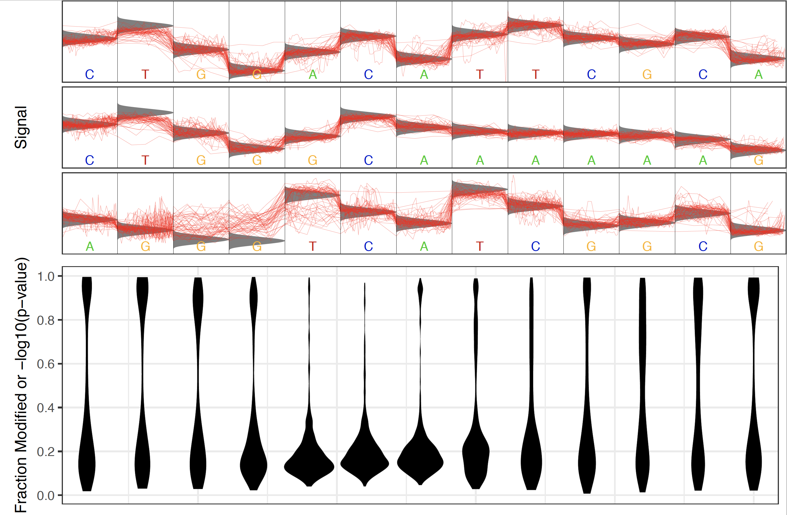

***************
Tombo Tutorials
***************

This page contains several tutorials with commands to perform suggested Tombo analysis pipelines.

.. contents:: :local:

Human CpG Methylation Detection
-------------------------------

Detect CpG methylation and output to browser file wiggle format.

::

   # re-squiggle raw reads
   tombo resquiggle path/to/fast5s/ reference.fasta \
      --processes 4 --num-most-common-errors 5

   # run modified base detection
   tombo detect_modifications alternative_model \
      --fast5-basedirs path/to/fast5s/ \
      --statistics-file-basename human_cpg_testing \
      --alternate-bases CpG --processes 4

   # output to genome browser compatible format
   tombo text_output browser_files \
      --fast5-basedirs path/to/fast5s/ \
      --statistics-filename human_cpg_testing.CpG.tombo.stats \
      --file-types coverage dampened_fraction \
      --browser-file-basename human_cpg_testing

Resulting files:

  - human_cpg_testing.coverage.plus.bedgraph
  - human_cpg_testing.coverage.minus.bedgraph
  - human_cpg_testing.CpG.dampened_fraction_modified_reads.plus.wig
  - human_cpg_testing.CpG.dampened_fraction_modified_reads.minus.wig

can be loaded into a genome browser for visualization or processed with bioinformatic tools taking the wiggle format.

De novo Bacterial Modified Base Detection
-----------------------------------------

This tutorial walks through the steps to estimate a methylase recognition motif as well as identifying the most likely modified base within that motif. The tutorial then walks through the steps to train a more accurate motif model and use the model to call modified sites in a new sample. Finally, Tombo provides tools to validate the accuracy for this model.

::

   # re-squiggle raw reads
   tombo resquiggle path/to/fast5s/ reference.fasta \
      --processes 4 --num-most-common-errors 5

   # run de novo modified base detection for motif discovery
   tombo detect_modifications de_novo \
      --fast5-basedirs path/to/fast5s/ \
      --statistics-file-basename de_novo_testing \
      --processes 4

   # output reference sequence around most significantly modified sites
   tombo text_output signif_sequence_context \
      --fast5-basedirs path/to/fast5s/ \
      --statistics-filename de_novo_testing.tombo.stats \
      --sequences-filename de_novo_testing.fasta

   # use command line meme (conda install -c bioconda meme) to estimate modified motif(s)
   meme -oc de_novo_testing.meme -dna \
      -mod zoops de_novo_testing.fasta

MEME will produce enriched motifs given the sites identified by Tombo de novo modified base detection. These motifs can be use to search public data bases for known methlyase recognition motifs and the exact modified base identity.

While the Tombo framework cannot identify the type of modified base present within a motif context, the relative position of the modified base within that motif can be estimated using the ``tombo plot motif_with_stats`` command. This plot will identify the sites in the reference with the most significantly modified base testing values within a set distance of the designated motif and plot the generated statistics centered on this motif. For example if one had found the E. coli dcm ``CCWGG`` motif the ``tombo plot motif_with_stats`` command could be run as follows:

::

   tombo plot motif_with_stats --fast5-basedirs path/to/fast5s/ \
      --motif CCWGG --genome-fasta reference.fasta \
      --statistics-filename de_novo_testing.tombo.stats \
      --pdf-filename de_novo_testing.pdf

This would produce a plot like this:

.. figure::  _images/stat_dist.png
   :align: center

----

Note that the most significant sites identified for this plot need not be within the motif provided. So if a random motif (not containing a methylase recognition motif in the sample of interest) is provided there should be no enrichment for significant sites within the motif. For example the ``CAW`` motif produces the following results:

----

Following this analysis a more accurate Tombo motif model can be produced in order to test for this specific modification in this or new samples.

::

   # build model at discovered CCWGG motif and test on this sample
   tombo build_model estimate_motif_alt_reference \
      --fast5-basedirs path/to/fast5s/ \
      --alternate-model-filename novel_de_novo.tombo.model \
      --alternate-model-name novel_mod --motif-description CCWGG:2 \
      --processes 4
   tombo detect_modifications alternative_model \
      --fast5-basedirs path/to/fast5s/ \
      --statistics-file-basename novel_de_novo \
      --alternate-model-filename novel_de_novo.tombo.model --processes 4

   # use this model to call modifications in a new control sample
   tombo resquiggle path/to/control/fast5s/ reference.fasta \
      --processes 4 --num-most-common-errors 5
   tombo detect_modifications alternative_model \
      --fast5-basedirs path/to/control/fast5s/ \
      --statistics-file-basename novel_de_novo.control \
      --alternate-model-filename novel_de_novo.tombo.model --processes 4

Finally the quality of this model can be tested by comparing the results to a control sample which does not contain modifications (e.g. PCR).

::

   # validate model with ground truth comparison
   tombo plot sample_compare_roc --genome-fasta reference.fasta \
      --statistics-filenames novel_de_novo.novel_mod.tombo.stats \
      --control-statistics-filenames novel_de_novo.control.novel_mod.tombo.stats \
      --motif-descriptions CCWGG:2:"Novel De novo Modification" \
      --pdf-filename novel_de_novo.samp_comp_roc.pdf

This command will output quality metrics (AUC and mean AP) as well as plotting the ROC curve and precision-recall curve.

Build Motif-specific Model from Ground Truth
--------------------------------------------

In this tutorial a model is built from a sample containing modifications at known locations (e.g. bisulfite sequencing).

.. Note::

   In order to estimate a Tombo alternate base motif model, the sample must contain a valid reference observation for each k-mer (as defined by ``--upstream-bases`` and ``--downstream-bases``), and ideally many observations for each k-mer.

   Note also that these estimated k-mer levels are approximations of the expected signal levels and that larger sequence contexts likely modulate the signal levels in most cases.

In this example, we have a sample with a modification occuring at the second base in TT dimers (as defined by the ``--motif-description TT:2`` option) and the modification exists specifically at the sites defined within the provided ``--valid-locations-filename modified_locations.bed`` file.

::

   tombo resquiggle path/to/fast5s/ reference.fasta \
      --processes 4 --num-most-common-errors 5

   # build model specifying valid modificaiton locations
   tombo build_model estimate_motif_alt_reference \
      --fast5-basedirs path/to/fast5s/ \
      --alternate-model-filename known_TT_mod.tombo.model \
      --alternate-model-name TT_mod --motif-description TT:2 \
      --valid-locations-filename modified_locations.bed \
      --processes 4

As in the previous de novo bacterial tutorial, the quality of this model can be tested by comparing the results to a control sample which does not contain modifications (e.g. PCR).

::

   # test on modified and control samples
   tombo detect_modifications alternative_model \
      --fast5-basedirs path/to/fast5s/ \
      --statistics-file-basename modified_sample \
      --alternate-model-filename known_TT_mod.tombo.model --processes 4
   tombo detect_modifications alternative_model \
      --fast5-basedirs path/to/control/fast5s/ \
      --statistics-file-basename control_sample \
      --alternate-model-filename known_TT_mod.tombo.model --processes 4

   # validate model with ground truth comparison
   tombo plot sample_compare_roc --genome-fasta reference.fasta \
      --statistics-filenames modified_sample.TT_mod.tombo.stats \
      --control-statistics-filenames control_sample.TT_mod.tombo.stats \
      --motif-descriptions TT:2:"Known TT Modification" \
      --pdf-filename TT_mod.samp_comp_roc.pdf

RNA Level Testing
-----------------

RNA modifications can be more subtle to detect in raw nanopore data, so the ``tombo detect_modifications level_sample_compare`` compare method has been added in version 1.5. This tutorial walks through running this analysis and some considerations when doing so.

Running the ``level_sample_compare`` command is quite similar to other modified base detection methods:

::

   tombo detect_modifications level_sample_compare \
      --fast5-basedirs path/to/fast5s/ \
      --alternate-fast5-basedirs path/to/comparison/fast5s/ \
      --statistics-file-basename level_testing \
      --statistic-type ks --processes 4

There are several considerations when running this command:

  - This command computes effect size measures by default (as statistical measures are generally too dependent on sequencing depth, but are available via the ``--store-p-value`` option). Thus a higher read coverage threshold generally provides more robust results (``--minimum-test-reads`` has a default of ``50`` for ``level_sample_compare`` command).
  - The effect size meaasure produced should not be interpreted as a fraction of modified bases or confidence metric for a modified base at a site (though effect sizes for KS and U tests are in the range fro 0 to 1). Different modifications within different sequence contexts will produce different effect sizes under ideal conditions. But given higher read depth peaks in this value within a sample can be useful especially for hypothesis generation.
